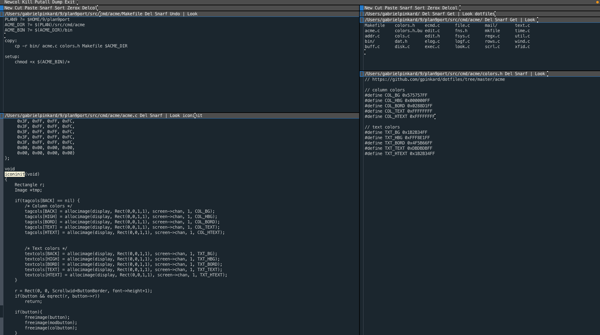

### Gabe's ACME Colors

This is the [ACME editor](https://en.wikipedia.org/wiki/Acme_(text_editor)) with a few changes I made to the colorscheme. The new colors are defined in **colors.h**, and used in **acme.c** (see the **iconinit** function).

I use [plan9port](https://github.com/9fans/plan9port) to get ACME. Clone the repository, then put **acme.c**, **colors.h**, **Makefile**, and the **bin/** directory into **$PLAN9/src/cmd/acme/** (overriding the original acme.c file). Then run the plan9port's **./INSTALL** script. Afterwards, run **make setup** from the Makefile (**$PLAN9/src/cmd/acme/Makefile**)

The **bin/** directory contains bash scripts for various tasks (currently just a start script). Alias `acme_start` to `acme`

